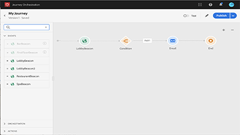

# Visão geral

[!UICONTROL Journey Orchestration] é um serviço de aplicativos integrado à Adobe Experience Platform. Ele permite que você crie casos de uso de orquestração em tempo real que aproveitam dados contextuais armazenados em eventos ou fontes de dados.

## Novidades

* **[eventos da etapa de viagem do Relatórios para Adobe Experience Platform](/help/how-to-find-help-with-journey-orchestration.md)**    
   *Saiba quais são os eventos de etapa de jornada e quais etapas de dados são criadas automaticamente no Experience Platform e como explorá-los.*
* **[Uso de eventos de qualificação de segmento](/help/using-segment-qualification-events.md)**    
   *Este vídeo fornece uma breve introdução sobre como criar uma jornada com um evento de qualificação de segmento como ponto de entrada ou saída.*

## Escolhas do pessoal

<table>
<tr>
  <td>
    
    

      <a href="./understanding-journey-orchestration.md">
    <strong>Noções básicas sobre o Journey Orchestration</strong>
    </a>
    

    

    <em>Entenda o conceito de Journey Orchestration, os tipos de casos de uso que ele permite e os elementos-chave de como o Journey Orchestration funciona.</em>
    

  </td>
  <td>
    
    

      <a href="./create-a-journey.md">
    <strong>Criar uma jornada (vídeo)</strong>
    </a>
    

    

    <em>Saiba como criar uma nova jornada, start com um evento, usar orquestrações para controlar o fluxo e o tempo de uma jornada, e usar ações para se engajar em pontos da jornada.</em>
    

  </td>
  <td>
   
    

      <a href="./analyze-a-journey-via-reporting-tools.md">
    <strong>Analisar uma jornada através das ferramentas do Relatórios</strong>
    </a>
    

    

    <em>Saiba como navegar até o relatórios para sua jornada, como personalizar intervalos de datas para seu relatório e como salvar um modelo de relatórios para uso futuro. </em>
    

  </td>
</tr>
</table>

## Recursos adicionais

* [Centro de ajuda do Journey Orchestration](https://docs.adobe.com/content/help/en/journeys/using/journey-orchestration-home.html)
* [Tutorials Adobe Experience Platform](https://docs.adobe.com/content/help/en/platform-learn/tutorials/overview.html)

